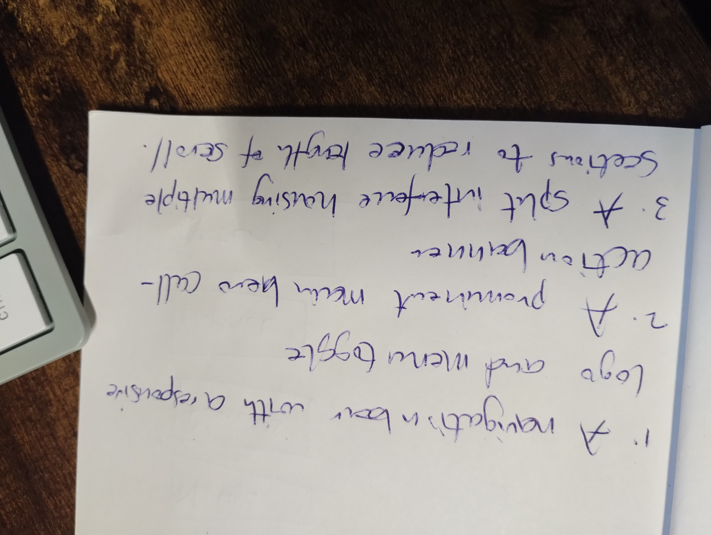
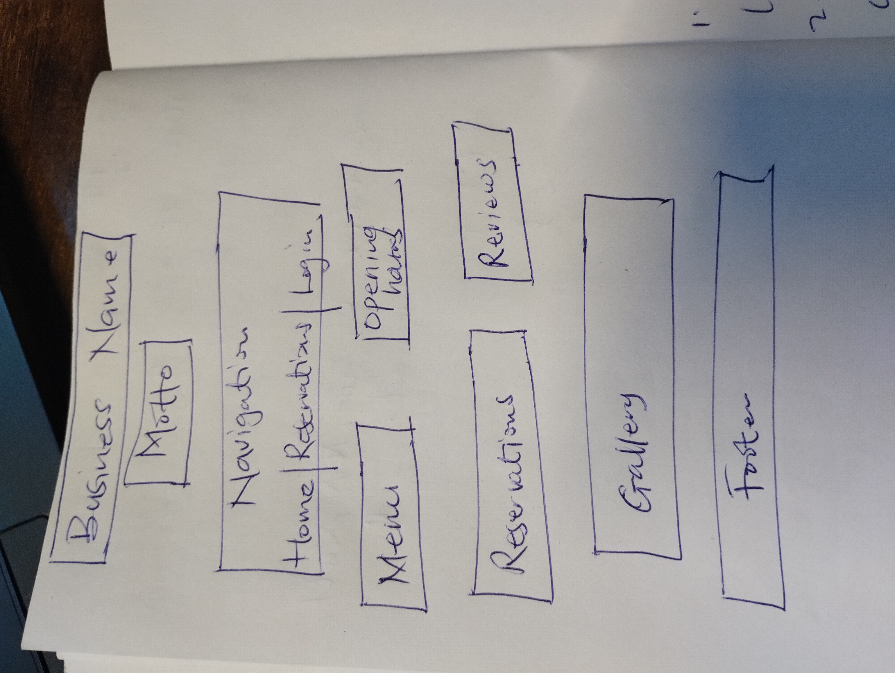
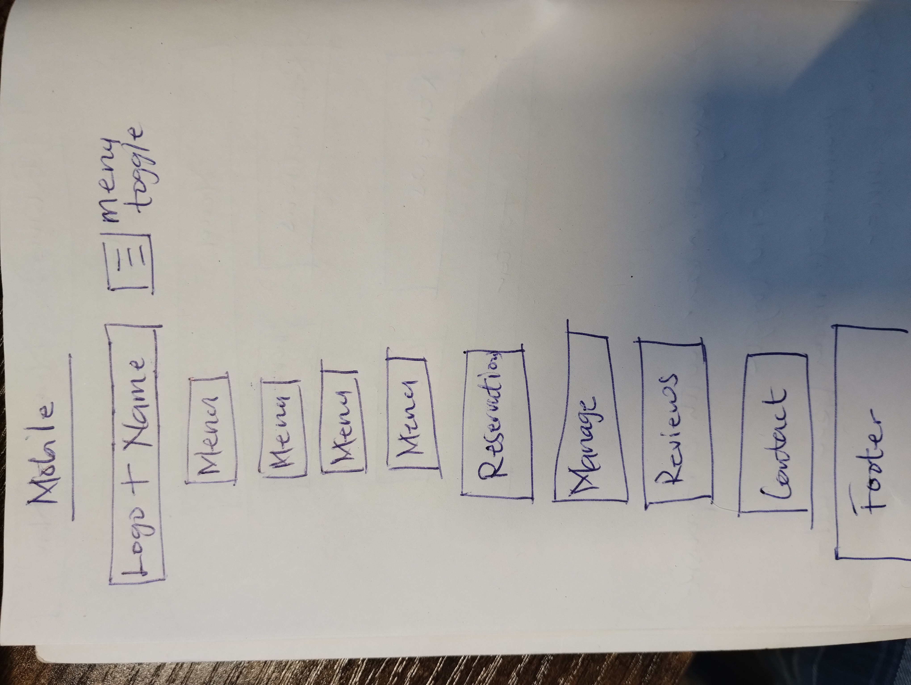
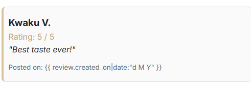

# Nala Restaurant - Multi-Table Reservation System

Nala Restaurant is a full-stack, data-driven web application designed to streamline dining table allocations and customer testimonials. Built using the Django's Model-Template-View framework and a PostgreSQL database, the platform features a single-page interactive dashboard where users can create, modify, and manage dining reservations asynchronously without continuous page reloads.

Live web address: `https://nalarestaurant-c999be5df618.herokuapp.com/`  
Admin Panel: `https://nalarestaurant-c999be5df618.herokuapp.com/admin/login/?next=/admin/`  
Admin Panel username: ` u45313`  
Admin Panel password: `nalarestaurant`
Email Address associated with Admin Panel: `danielvivor@yahoo.com`

---

## 1. Project Planning & Agile Methodology

This project was developed following Agile software development methodologies. All significant functionalities, bugs, and deployment tasks were broken down into distinct User Stories, prioritized, and tracked using an Agile Kanban Board.

### User Stories & Project Goals Mapping
* **EPIC 1: User Authentication & Security**
  * *User Story:* As a visitor, I can create an account and log in so that my reservation records remain isolated and secure.
  * *Goal Mapping:* Satisfies access validation and data-isolation milestones.
* **EPIC 2: Interactive Reservation Engine**
  * *User Story:* As an authenticated customer, I want to book multiple tables in a single session so that I can host large group events.
  * *Goal Mapping:* Core domain purpose handling multi-table JSON payloads.
* **EPIC 3: Booking Self-Management (CRUD)**
  * *User Story:* As a registered user, I want to view, update, or cancel my upcoming reservations.
  * *Goal Mapping:* Fulfills complete relational database manipulation criteria.
* **EPIC 4: Public Feedback & Social Proof**
  * *User Story:* As a diner, I want to submit platform reviews with star ratings to share my culinary experience with future guests.
  * *Goal Mapping:* Ancillary custom data collection and rendering implementation.

---

## 2. User Experience (UX) Design

### 2.1 Design Strategy & Reasoning
Nala Restaurant is an intercontinental restaurant seeking a digital space that combines informational content with an interactive client reservation engine. The target demographic requires an interface that can book and check table entries instantly on both mobile devices and desktop screens.  
* **The Single-Page Dashboard Concept:** To minimize user friction, a single-page dashboard architecture was chosen for Nala Restaurant. Rather than forcing a user to navigate through multiple separate sub-pages to log in, place a booking, and check their records, all features are anchored directly on the homepage within interactive columns. This dramatically reduces user steps.  
* **Visual States & Accessibility (WCAG):** Form fields dynamically adapt based on session status. Unauthenticated visitors are met with disabled visual inputs and an explicit warning banner prompting authentication, ensuring clear task flow boundaries before data entry.  
* **Responsiveness:** Built with a fluid CSS Flexbox and grid container layout (`.dashboard-grid`). On desktop resolutions, columns are aligned side-by-side to optimize wide viewports; on mobile viewports (<768px), elements wrap to a stacked 100% width grid for easy touch targets.

### 2.2 Wireframes and Layout Evolution

The user interface for Nala Restaurant evolved through iterative paper wireframes. The process focused on optimizing screen real estate, reducing layout scroll length, and establishing a fluid responsive system between wide desktop layouts and narrow mobile viewports.

#### I. Core Design Intentions & Layout Groundwork
Three core design requirements anchored the layout strategy:
1.  **A navigation bar with a responsive logo and menu toggle** to preserve usability across differing client screen scales.
2.  **A prominent main hero call-to-action banner** to immediately establish branding and direct user intent toward booking tasks.
3.  **A split interface housing multiple sections to reduce length of scroll**, minimizing user friction by grouping high-priority functional components together.

*   **Initial Layout Structure:** The early blueprint aimed to introduce a standard content block flow containing central text headings ("Business Name" and "Motto") sitting directly above a full-width navigation menu bar. Below the header, components were organized using an asymmetric side-by-side grid, separating static restaurant details (Menu, Opening Hours, Gallery) from interactive data sections (Reservations, Reviews).
*   **Refined Structural Adjustments:** To better achieve the design goal of reducing page scroll length, the architecture was tightened. The full-width navbar was refactored into a modern layout, floating the menu navigation links ("Nav") directly inline with the "Business Name". Static blocks like "Opening Hours" and "Gallery" were consolidated out of the main grid path, prioritizing direct CRUD access by placing the "Reservations" engine and "Manage Bookings" control panels side-by-side in a streamlined dashboard framework.
*   **Mobile Viewport Adaptation:** To transition the interface smoothly to smaller screens, the horizontal layout columns collapse into a single vertical stream. The desktop navbar condenses into a clean title header ("Logo + Name") accompanied by a JavaScript-driven expandable hamburger icon ("Menu Toggle"). All inline multi-column sections collapse neatly to 100% viewport width cards, keeping the interactive reservation form and review elements easy to read and touch on small devices without horizontal overflow.

#### II. Wireframes vs. Final Implementation Notes
The final live product maintains a direct lineage back to these paper sketches, realizing the "split interface dashboard concept" via a modern CSS Grid framework (`.dashboard-grid`). 

While the early sketches acted as structural placeholders, the live production web app introduces polished design patterns like disabling dynamic form inputs for unauthenticated visitors, styling active validation alerts, and updating the DOM asynchronously using JavaScript `fetch()` handlers. This approach eliminates full page refreshes, successfully keeping the entire customer journey unified on a single screen layout.

### 2.3 Layout Structure & UI Mockup Reasoning
* **The Single-Page Dashboard Framework:** To prevent continuous loading screen latency, the booking portal uses asynchronous operations (`main.js`). This layout maintains user focus.
* **Authentication Notice Banner:** Unauthenticated users see disabled fields and an explicit red banner prompting them to log in. This prevents layout confusion by making interaction boundaries obvious before form entry.

### 2.4 Database & System Flow Diagrams
The system's data management architecture adheres to a strict relational flow. The data lifecycle mirrors user progression through the application's interface:

User Input (Frontend UI) ──► JavaScript Fetch ──► Django Views (Control) ──► PostgreSQL DB (Storage)

### 2.5 Implementation Verification
The initial design objectives were successfully executed in production:
* **Planned Feature:** Dynamic row multiplication to facilitate multi-table event bookings.
  * *Implementation:* Realized via an HTML5 `<template>` tag cloned dynamically via `main.js` upon clicking `+ Add Another Table`.
* **Planned Feature:** Access-restricted visual states.
  * *Implementation:* Realized via Django conditional tags (``) transforming input fields into clean hidden verification elements or disabled visual placeholders depending on user state.

---

## 3. Database Architecture, Custom Data Models & MVC Paradigm

The Nala Restaurant platform is a database-backed web application built on the Django Model-Template-View (MTV) architectural framework. This structural pattern guarantees a clean separation of concerns across data storage, presentation layout, and backend control logic.

<table>
  <thead>
    <tr>
      <th colspan="3" style="text-align: center;">ARCHITECTURAL PARADIGM</th>
    </tr>
  </thead>
  <tbody>
    <tr>
      <td><b>MODEL (Data)</b></td>
      <td><b>TEMPLATE (Presentation)</b></td>
      <td><b>VIEW (Control)</b></td>
    </tr>
    <tr>
      <td>PostgreSQL Blueprints</td>
      <td>Dynamic HTML5/JS UI Dashboard</td>
      <td>Python Request Handlers</td>
    </tr>
  </tbody>
</table>

### 3.1 The MTV Implementation Pattern

* **Model (The Data Layer):** This acts as the database blueprint. The backend Python classes define the schema, data validation boundaries, and relational hooks stored inside the production cloud PostgreSQL database.
* **Template (The Presentation Layer):** The user interface leverages the Django Template Language alongside standard HTML5/CSS3 to dynamically adapt the DOM based on user session states (e.g., hiding or revealing protected interactive booking options depending on `user.is_authenticated` evaluations).
* **View (The Control Layer):** Operating as the system bridge, Python functions inside `views.py` intercept asynchronous frontend JavaScript `fetch()` network payloads. They handle access permission vetting, data validation checks, and direct the underlying Model layer to commit state alterations to the database before returning standardized JSON responses.

### 3.2 Database Schema & Model Specifications (Requirement 7.1)

The object-relational database architecture features two custom database models managed via Django's Object-Relational Mapper (ORM).

#### I. Built-In User Model (`django.contrib.auth`)
* **Purpose:** Manages core application authentication, security hashing constraints, and distinct session profiles.
* **Fields:** `id` (Primary Key), `username`, `password`, `email`.

#### II. Reservation Model (Custom)
* **Purpose:** The core custom model handling multi-table operational dining table bookings mapped to specific customer accounts. It links directly to the standard Django User model to ensure records are isolated to individual accounts.
* **Fields & Data Constraints:**
    * `user` (`ForeignKey`): Connects a reservation record directly to an individual profile in the standard Django User table. This implements a strict **One-to-Many** relationship, ensuring that users retain isolated ownership of their booking history.
    * `email` (`EmailField`): Captures valid contact parameters for notification strings.
    * `date` (`DateField`): Enforces correct ISO calendar formatting structures (`YYYY-MM-DD`).
    * `time` (`TimeField`): Captures operational restaurant allocation windows.
    * `guests` (`IntegerField`): Restricts entry values with configured business thresholds (tracks party size, validated with values between 1 and 12).

#### III. Review Model (Custom)
* **Purpose:** An ancillary standalone data layer deployed to handle customer testimonials and platform interactions, allowing visitors to write public feedback and star ratings to serve as social proof.
* **Fields & Data Constraints:**
    * `name` (`CharField`): Captures the submission string name of the reviewer.
    * `email` (`EmailField`): Identifies the origin email address of the feedback author.
    * `rating` (`IntegerField`): Restricts evaluation values to a strict 1-to-5 star scale metric.
    * `comment` (`TextField`): Stores open-ended written customer testimonials.
    * `created_on` (`DateTimeField`): Automatically captures the timestamp of the submission and auto-stamps the record creation time (`auto_now_add=True`).

### 3.3 Relational Data Manipulation (CRUD) Flow

The domain application implements full transactional CRUD data lifecycles seamlessly across the database through its view routing layers:
1.  **Create ($C$):** Authenticated users complete booking parameter input fields. The frontend interceptor compiles these variables into a JSON payload, passing it via an asynchronous network push to the `create_booking` controller to generate a new row inside the PostgreSQL database table.
2.  **Read ($R$):** Upon dashboard authorization, the frontend triggers requests to the `view_reservations` endpoint. The view filters rows matching the user's explicit identification token from the database and returns a dataset array to construct dynamic UI view nodes.
3.  **Update ($U$):** Users can seamlessly alter individual reservation variables directly inside their dashboard grid. Modified details are passed directly to `update_reservation`, executing validation routines before updating the structural data row.
4.  **Delete ($D$):** Clicking cancellation icons securely sends specific record identifiers to the `cancel_reservation` backend controller, removing the record from the database and dropping the associated UI element without interrupting the browser state.

---

## 4. Testing & Code Validation

### 4.1 Automated Python Backend Testing
Automated backend verification was implemented using Django's built-in `TestCase` framework to check views, routing, and access middleware constraints.

* **Execution Command:** `python manage.py test`
* **Test Outcome:** `OK` (100% Passing)

#### Documented Test Profiles:
* `test_authenticated_user_can_access_homepage`: Confirms that the root path resolves with a standard HTTP 200 OK code when reached by valid sessions.
* `test_anonymous_user_is_blocked_from_booking`: Validates that unauthenticated form submission intercepts are rejected or redirected, preventing anonymous database pollution.

### 4.2 JavaScript Manual Testing Matrix
Frontend interactive logic controlled by `main.js` was manually evaluated against standard behavior metrics: Functionality, Usability, Responsiveness, and Data Management. Testing was carried out across modern web layouts using Google Chrome DevTools.

| Category | Target Element / Feature | Action Performed | Expected Frontend Result | Pass / Fail |
| :--- | :--- | :--- | :--- | :--- |
| **Functionality** | Mobile Navigation Toggle (`.nav-toggle`) | Clicked hamburger icon on screen sizes below 768px. | JavaScript toggles the `aria-expanded` attribute, altering CSS class rules to smoothly slide out the menu. | **PASS** |
| **Usability** | Dynamic Row Multiplier (`#add-table-btn`) | Clicked "+ Add Another Table" button inside an authenticated session. | Script clones the underlying HTML `<template>`, dynamically alters labels to read "Table #2", and appends it to the container. | **PASS** |
| **Usability** | Row Removal Button (`.remove-table`) | Clicked the closing '×' element on a newly injected table card. | JavaScript targets the closest `.table-item` parent card and securely drops it from the DOM viewport. | **PASS** |
| **Data Management** | Dynamic Booking Submission (`#multi-reservation-form`) | Completed multiple table records and clicked "Confirm All Bookings". | JS intercepts default browser submission via `preventDefault()`, serializes rows to JSON, triggers an async fetch call, and unhides `#booking-success-msg`. | **PASS** |
| **Data Management** | Dynamic Retrieval UI (`#view-reservation-form`) | Entered an authorized email account string and clicked "Find My Table(s)". | JS issues a GET/POST request, parses the database return array asynchronously, and structurally prints clean cards straight inside the `#reservation-results` element. | **PASS** |
| **Responsiveness** | Responsive Dashboard Grid (`.dashboard-grid`) | Switched browser viewports from 1440px desktop resolutions down to 375px mobile viewports. | JavaScript-driven elements and flex-grid layouts realign fluidly; form text inputs wrap to 100% width on small viewports without overlapping text. | **PASS** |

### 4.3 Code Validation
* **Python:** All written backend code (`views.py`, `models.py`, `urls.py`, `admin.py`) follows Python PEP8 style guidelines, standardized indentation and naming conventions.
* **HTML/CSS:** Frontend layouts have been run through the W3C Markup Validation services, showing clean, error-free markup structure.

### 4.4 Known Bugs & Items to Fix
#### I. Review Date Formatting Rendering Anomaly

*   **Issue Description:** As captured in the screenshot above, when customer testimonials are pulled from the database and loaded into the frontend interface, the exact date on which they were written fails to render dynamically. Instead, the raw Django Template Language syntax template tag literal string (`{{ review.created_on|date:"d M Y" }}`) is visible to the end user.
*   **Root Cause Analysis:** This bug occurs due to a structural conflict between the backend server-side templating layer and asynchronous frontend script logic. Because the review cards are rendered or appended on the client side using JavaScript DOM manipulation or API payload parsing, the browser interprets the curly brace markers as static plain text string literals rather than executable server-side code block filters.
*   **Planned Fix:** 
    1. Update the backend endpoint to include a pre-formatted string parameter (e.g., `formatted_date`) within the JSON payload array sent to the client.
    2. Refactor the frontend JavaScript template engine template string literal to target that explicit attribute via native JS template literal syntax (`${review.formatted_date}`) instead of utilizing Django filters directly in HTML elements.

#### II. Unauthenticated Review / Identity Spoofing Vulnerability
*   **Issue Description:** The review submission engine allows any input string within the "Name" and "Email" form fields without checking them against the active user session database record. 
*   **Root Cause:** The `Review` model is structured using independent, flat `CharField` and `EmailField` attributes instead of a relational link. Because the backend view processes incoming JSON payloads directly without validating whether the payload email matches `request.user.email`, a logged-in user can submit reviews under an arbitrary name, or bypass session association entirely.
*   **Planned Fix:** Refactor the custom `Review` model schema to drop the detached text fields and implement a structured relationship hook: `user = models.ForeignKey(User, on_now=models.CASCADE)`. The view controller will then be modified to explicitly bind reviews via `review.user = request.user`, guaranteeing absolute account integrity and blocking identity spoofing.

---

## 5. Deployment Guide

The application is deployed live in production on Heroku.

### Local vs. Production Isolation
Environmental variables and sensitive secret values are kept completely isolated:
* **Local Space:** Settings look for a local `env.py` file to populate configuration strings (`SECRET_KEY`, `LOCAL_DB_PASS`).
* **Production Space:** `env.py` is ignored via `.gitignore`. Production configurations are securely injected directly via Heroku's Config Vars panel (`SECRET_KEY`, `DATABASE_URL`).

### Deployment Steps Execution
1. Ensure a valid `Procfile` exists specifying the WSGI web layer: `web: gunicorn nala_project.wsgi`.
2. Save project dependencies: `pip freeze > requirements.txt`.
3. Create app via Heroku CLI: `heroku create app-name`.
4. Provision the cloud database addon: `heroku addons:create heroku-postgresql:essential-tier-0 -a nalarestaurant`.
5. Set secret production config parameters in Heroku's environment panel.
6. Build and push production branch: `git push heroku main`.
7. Initialize production database schema structures: `heroku run python manage.py migrate`.  
Live web address: `https://nalarestaurant-c999be5df618.herokuapp.com/`  
Admin Panel: `https://nalarestaurant-c999be5df618.herokuapp.com/admin/login/?next=/admin/`  
Admin Panel username: ` u45313`  
Admin Panel password: `nalarestaurant`
Email Address associated with Admin Panel: `danielvivor@yahoo.com`

---

## 6. Credits & Acknowledgements
* Core application architecture guidance, deployment protocols, and testing strategies designed in accordance with the Code Institute Full-Stack Web Development specification criteria.
